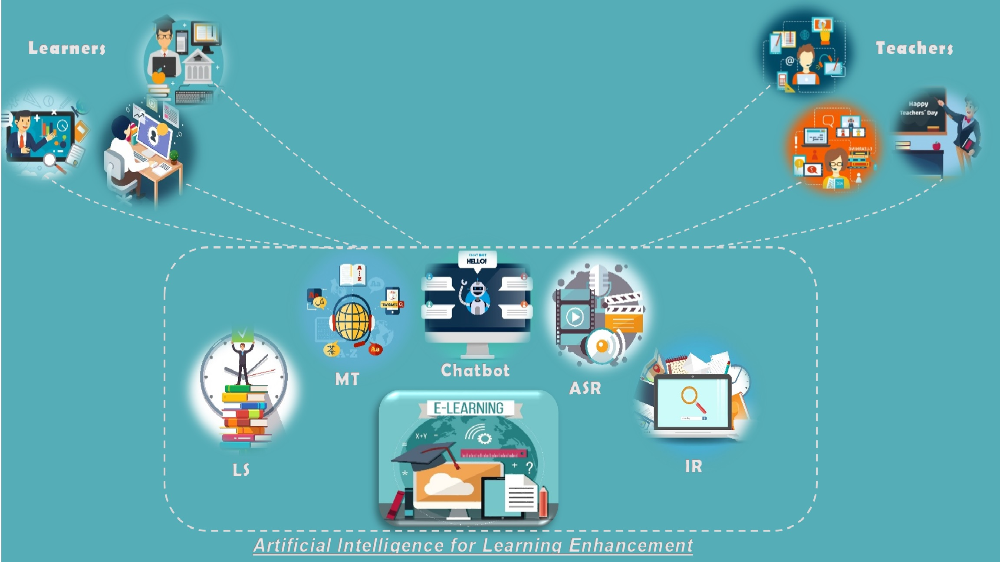

## Welcome to AILE Project page


AILE : Artificial Intelligence for Learning Enhacement

This project intend to produce ground-breaking eLearning innovations. Our objective is to support the revolution in the way people interact with online content by developing the next-generation of eLearning environments based on the use of artificial intelligence; enabling learners to achieve unprecedented levels of access and efficiency.

Teaching is the process of knowledge and experience sharing. Nowadays, teaching is no more instructor-centered activity, in which knowledge is transmitted from an instructor to novice learners. Instead, teaching is rather seen a learner-centered activity where the teacher ensures that learning is made possible for novice learners through supports, guidance, and stimulation.

Over the last few years, new technologies has result in a fundamental change in the education practices requiring new learning models which can adapt to each learner and at every skill level and therefore students are better equipped to learn on their own.


### Markdown

Markdown is a lightweight and easy-to-use syntax for styling your writing. It includes conventions for

```markdown
Syntax highlighted code block

# Header 1
## Header 2
### Header 3

- Bulleted
- List

1. Numbered
2. List

**Bold** and _Italic_ and `Code` text

[Link](url) and 
```

For more details see [GitHub Flavored Markdown](https://guides.github.com/features/mastering-markdown/).

### Jekyll Themes

Your Pages site will use the layout and styles from the Jekyll theme you have selected in your [repository settings](https://github.com/AILE-Project/AILE-Project.github.io/settings). The name of this theme is saved in the Jekyll `_config.yml` configuration file.

### Support or Contact

Having trouble with Pages? Check out our [documentation](https://help.github.com/categories/github-pages-basics/) or [contact support](https://github.com/contact) and we’ll help you sort it out.
